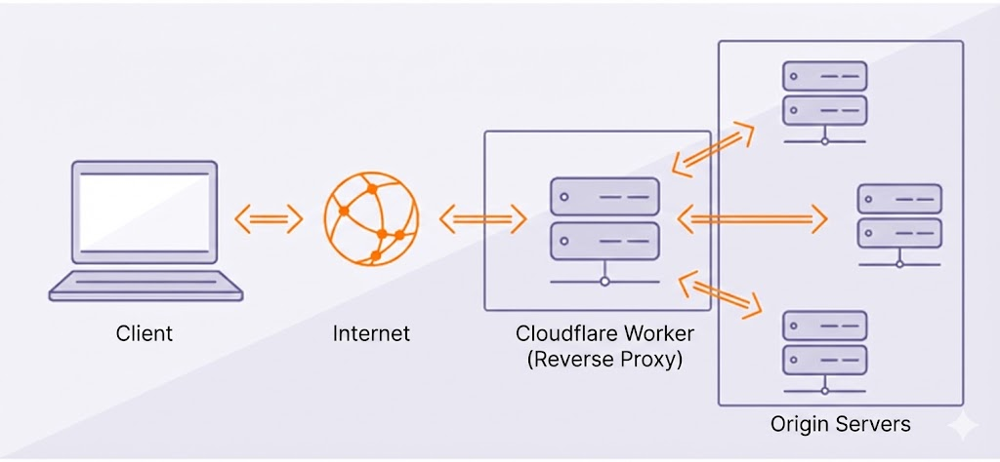

Ever wanted to serve multiple applications under a single domain? Maybe you have a marketing site at one location and your app at another, but you want them both accessible from `yourdomain.com`. A **reverse proxy** is the perfect solution, and **Cloudflare Workers** makes this incredibly simple to set up.

In this post, I'll walk you through building a path-based reverse proxy that routes traffic to different backend services based on the URL path.

## What is a Reverse Proxy?

A reverse proxy sits between clients and your backend servers. Instead of clients connecting directly to your servers, they connect to the proxy, which then forwards requests to the appropriate backend.



### Why Use a Reverse Proxy?

- **Unified domain**: Serve multiple services under one domain
- **Path-based routing**: Route `/app` to your application, `/` to your landing page
- **SSL termination**: Cloudflare handles HTTPS for you
- **Edge performance**: Workers run at Cloudflare's edge, close to your users
- **Zero server management**: No infrastructure to maintain

## Setting Up the Project

First, let's create a new Cloudflare Workers project:

```bash
npm create cloudflare@latest my-reverse-proxy
cd my-reverse-proxy
```

Choose "Hello World" as your starter template when prompted.

## The Reverse Proxy Code

Here's the complete reverse proxy implementation. This example routes traffic between two sites:
- `/app/*` → Your application (e.g., `app.example.com`)
- Everything else → Your landing page (e.g., `landing.example.com`)

### Basic Implementation

```javascript
// src/index.js

export default {
  async fetch(request, env, ctx) {
    const url = new URL(request.url);
    const path = url.pathname;

    // Define your backend hosts
    const LANDING_HOST = 'landing.example.com';
    const APP_HOST = 'app.example.com';

    // Determine which backend to use based on path
    let targetHost;
    let targetPath = path;

    if (path.startsWith('/app')) {
      targetHost = APP_HOST;
      // Remove the /app prefix when forwarding
      targetPath = path.replace(/^\/app/, '') || '/';
    } else {
      targetHost = LANDING_HOST;
    }

    // Construct the target URL
    const targetUrl = new URL(request.url);
    targetUrl.hostname = targetHost;
    targetUrl.pathname = targetPath;

    // Create the proxied request
    const proxyRequest = new Request(targetUrl.toString(), {
      method: request.method,
      headers: request.headers,
      body: request.body,
      redirect: 'manual', // Handle redirects manually
    });

    // Forward the request and return the response
    const response = await fetch(proxyRequest);
    
    // Return the response with original headers
    return new Response(response.body, {
      status: response.status,
      statusText: response.statusText,
      headers: response.headers,
    });
  },
};
```

## How It Works

Let's break down what's happening step by step:

### 1. Parse the Incoming Request

```javascript
const url = new URL(request.url);
const path = url.pathname;
```

We extract the URL and pathname from the incoming request. If a user visits `yourdomain.com/app/dashboard`, the path would be `/app/dashboard`.

### 2. Route Based on Path

```javascript
if (path.startsWith('/app')) {
  targetHost = APP_HOST;
  targetPath = path.replace(/^\/app/, '') || '/';
} else {
  targetHost = LANDING_HOST;
}
```

This is where the magic happens. We check if the path starts with `/app`:
- If yes, we route to the app backend and strip the `/app` prefix
- If no, we route to the landing page

So `/app/dashboard` becomes `/dashboard` on the app backend.

### 3. Construct and Forward the Request

```javascript
const targetUrl = new URL(request.url);
targetUrl.hostname = targetHost;
targetUrl.pathname = targetPath;

const proxyRequest = new Request(targetUrl.toString(), {
  method: request.method,
  headers: request.headers,
  body: request.body,
  redirect: 'manual',
});
```

We build a new URL with the target host and create a new `Request` object, preserving all the original request properties (method, headers, body).

### 4. Return the Response

```javascript
const response = await fetch(proxyRequest);
return new Response(response.body, {
  status: response.status,
  statusText: response.statusText,
  headers: response.headers,
});
```

We fetch from the target and return the response as-is to the client.

## Enhanced Version with Environment Variables

For production, you'll want to use environment variables instead of hardcoding hosts:

```javascript
// src/index.js

export default {
  async fetch(request, env, ctx) {
    const url = new URL(request.url);
    const path = url.pathname;

    // Get hosts from environment variables
    const LANDING_HOST = env.LANDING_HOST;
    const APP_HOST = env.APP_HOST;

    let targetHost;
    let targetPath = path;

    if (path.startsWith('/app')) {
      targetHost = APP_HOST;
      targetPath = path.replace(/^\/app/, '') || '/';
    } else {
      targetHost = LANDING_HOST;
    }

    const targetUrl = new URL(request.url);
    targetUrl.hostname = targetHost;
    targetUrl.pathname = targetPath;
    targetUrl.port = ''; // Use default ports

    // Clone headers and modify host
    const headers = new Headers(request.headers);
    headers.set('Host', targetHost);
    headers.set('X-Forwarded-Host', url.hostname);
    headers.set('X-Forwarded-Proto', url.protocol.replace(':', ''));

    const proxyRequest = new Request(targetUrl.toString(), {
      method: request.method,
      headers: headers,
      body: request.body,
      redirect: 'manual',
    });

    try {
      const response = await fetch(proxyRequest);
      
      // Clone response headers to modify them
      const responseHeaders = new Headers(response.headers);
      
      // Handle redirects - rewrite Location header
      const location = responseHeaders.get('Location');
      if (location) {
        const locationUrl = new URL(location, targetUrl);
        if (locationUrl.hostname === targetHost) {
          locationUrl.hostname = url.hostname;
          if (targetHost === APP_HOST) {
            locationUrl.pathname = '/app' + locationUrl.pathname;
          }
          responseHeaders.set('Location', locationUrl.toString());
        }
      }

      return new Response(response.body, {
        status: response.status,
        statusText: response.statusText,
        headers: responseHeaders,
      });
    } catch (error) {
      return new Response(`Proxy Error: ${error.message}`, {
        status: 502,
        headers: { 'Content-Type': 'text/plain' },
      });
    }
  },
};
```

### Configure Environment Variables

Update your `wrangler.toml`:

```toml
name = "my-reverse-proxy"
main = "src/index.js"
compatibility_date = "2024-01-01"

[vars]
LANDING_HOST = "landing.example.com"
APP_HOST = "app.example.com"
```

For sensitive values, use secrets instead:

```bash
npx wrangler secret put LANDING_HOST
npx wrangler secret put APP_HOST
```

## Key Improvements in Enhanced Version

### Proper Host Headers

```javascript
headers.set('Host', targetHost);
headers.set('X-Forwarded-Host', url.hostname);
headers.set('X-Forwarded-Proto', url.protocol.replace(':', ''));
```

Setting the correct `Host` header is crucial. Many backends use this header to generate URLs and handle routing. The `X-Forwarded-*` headers help backends know the original request details.

### Redirect Handling

```javascript
const location = responseHeaders.get('Location');
if (location) {
  const locationUrl = new URL(location, targetUrl);
  if (locationUrl.hostname === targetHost) {
    locationUrl.hostname = url.hostname;
    if (targetHost === APP_HOST) {
      locationUrl.pathname = '/app' + locationUrl.pathname;
    }
    responseHeaders.set('Location', locationUrl.toString());
  }
}
```

When your backend sends a redirect, we rewrite the `Location` header to point to your proxy domain, not the backend directly. This keeps users on your unified domain.

### Error Handling

```javascript
try {
  // ... proxy logic
} catch (error) {
  return new Response(`Proxy Error: ${error.message}`, {
    status: 502,
    headers: { 'Content-Type': 'text/plain' },
  });
}
```

Always handle errors gracefully. A 502 Bad Gateway is appropriate when the backend is unreachable.

## Deploying Your Proxy

Deploy to Cloudflare's edge network:

```bash
npx wrangler deploy
```

Then configure your domain in the Cloudflare dashboard to route traffic through your Worker.

## Common Use Cases

1. **Microservices Gateway**: Route different paths to different microservices
2. **A/B Testing**: Split traffic between old and new versions
3. **Migration**: Gradually migrate from one platform to another
4. **Multi-tenant Apps**: Route based on subdomain or path to different tenants

## Performance Considerations

Cloudflare Workers are incredibly fast because they run at the edge. However, keep these tips in mind:

- **Minimize path matching logic**: Keep conditionals simple
- **Use streaming**: The response body is streamed, not buffered
- **Cache when possible**: Add caching headers for static assets
- **Monitor with Workers Analytics**: Track performance in your Cloudflare dashboard

## Wrapping Up

Cloudflare Workers provides a powerful, serverless platform for building reverse proxies. With just a few lines of JavaScript, you can route traffic between multiple backends, all running at Cloudflare's edge network close to your users.

The path-based routing approach shown here is just the beginning. You can extend this to handle:
- Authentication and header injection
- Request/response transformation
- Rate limiting
- Custom caching strategies

Give it a try — you'll be surprised how easy it is to get started!

---

*Have questions or want to share your reverse proxy setup? Drop a comment below!*
