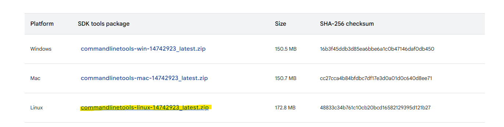

Developing React Native apps with Expo on WSL2 (Windows Subsystem for Linux) offers the power of Local with the convenience of Windows. However, getting the Android SDK, Node.js, and ADB to play nicely together can be tricky. 

After several rounds of trial and error, I've perfected a setup that is fast, reliable, and "just works." Here is the definitive guide.

## The Performance Secret: Use the WSL Filesystem

Before we install anything, **this is the most important rule**: Keep your project files in the WSL filesystem (e.g., `/home/username/projects`), NOT in `/mnt/c/`. 

Accessing files across the Windows/Linux boundary is significantly slower. By keeping your code in WSL, you’ll get near-native performance for `npm install`, build processes, and Hot Module Replacement (HMR).

> [!TIP]
> VS Code natively supports WSL. Simply open your WSL terminal, navigate to your project, and type `code .` to launch VS Code with a direct connection to your WSL environment.

---

## 1. Setting Up Node.js with NVM

Don't use `apt` to install Node.js. Use **NVM (Node Version Manager)** to easily switch between versions and avoid permission issues.

```bash
# Install NVM
curl -o- https://raw.githubusercontent.com/nvm-sh/nvm/v0.39.7/install.sh | bash

# Load nvm (or restart your terminal)
export NVM_DIR="$HOME/.nvm"
[ -s "$NVM_DIR/nvm.sh" ] && \. "$NVM_DIR/nvm.sh"

# Install the latest LTS version of Node
nvm install --lts
nvm use --lts
```

Check your versions:
```bash
node -v
npm -v
```

---

## 2. Installing Java (OpenJDK 17 / Amazon Correto 17)

Expo and Android require Java 17. Install it directly in WSL:

```bash
sudo apt update
sudo apt install openjdk-17-jdk -y
```

Verify the installation:
```bash
java -version
```

---

## 3. Setting Up the Android SDK

Instead of installing the full Android Studio inside WSL (which is heavy and requires a GUI), we’ll install the command-line tools manually.

### Create the SDK directory:
```bash
mkdir -p ~/android-sdk/cmdline-tools
cd ~/android-sdk/cmdline-tools
```

### Download Command Line Tools:
Go to the [Android Studio Downloads page](https://developer.android.com/studio#command-tools), scroll down and copy the link for the Linux command line tools, and download them


```bash
wget https://dl.google.com/android/repository/[latest_tools_version.zip]
unzip commandlinetools-linux-*.zip
mv cmdline-tools latest # Expo expects this specific structure
rm *.zip
```

### Configure Environment Variables:
Add these to your `~/.zshrc` or `~/.bashrc`:

```bash
export ANDROID_HOME=$HOME/android-sdk
export PATH=$PATH:$ANDROID_HOME/cmdline-tools/latest/bin
export PATH=$PATH:$ANDROID_HOME/platform-tools
export PATH=$PATH:$ANDROID_HOME/emulator
```

Reload your config: `source ~/.zshrc` (or `~/.bashrc`).

### Install necessary platforms:
Expo can do this automatically when running prebuild or generating native builds so you can skip this if you are using Expo Go.

```bash
sdkmanager --list
sdkmanager "platform-tools" "platforms;android-34" "build-tools;34.0.0"
```

---

## 4. The "Golden Trick": ADB Symlinking

This is where most WSL users get stuck. You likely want to use an Android emulator running on Windows or a physical device plugged into your PC. WSL needs to talk to the Windows ADB server.

The trick is to **replace the WSL adb with a symlink to the Windows adb.exe**.
This way we can access devices connected to windows host via ADB.

```bash
# Locate your Windows ADB (usually in your Windows user profile)
# Adjust the path below to your actual Windows username
WINDOWS_ADB="/mnt/c/Users/<YOUR_WINDOWS_USERNAME>/AppData/Local/Android/Sdk/platform-tools/adb.exe"

# Symlink it into your WSL path
sudo ln -sf "$WINDOWS_ADB" /usr/local/bin/adb
```

Now, when you run `adb devices` in WSL, it actually calls the Windows version, which can see your emulators and USB devices perfectly!

---

## 5. Installing Expo CLI

Install the Expo CLI globally (though `npx expo` is generally preferred for project-specific commands):

```bash
npm install -g expo-cli
```

---

## Summary of Path Setup

If you’re using Zsh, your `~/.zshrc` should look something like this:

```bash
# NVM
export NVM_DIR="$HOME/.nvm"
[ -s "$NVM_DIR/nvm.sh" ] && \. "$NVM_DIR/nvm.sh"

# Android SDK
export ANDROID_HOME=$HOME/android-sdk
export PATH=$PATH:$ANDROID_HOME/cmdline-tools/latest/bin
export PATH=$PATH:$ANDROID_HOME/platform-tools
export PATH=$PATH:$ANDROID_HOME/emulator

# Java
export JAVA_HOME=/usr/lib/jvm/java-17-openjdk-amd64
```

## Wrapping Up

With this setup, you get:
1. **Blazing fast performance** by staying in the WSL filesystem.
2. **Completely local android builds** with expo toolchain.
3. **Seamless device connectivity** via the ADB symlink trick.
4. **Easy version management** with NVM.

If you find any issues or any other guides make sure to ask them in comment section. 
Happy coding! 🚀
